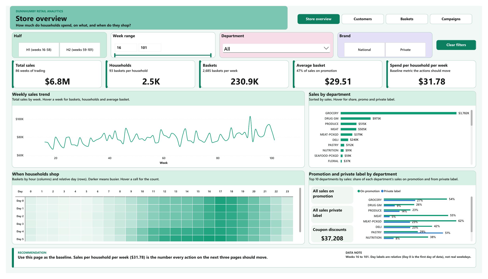
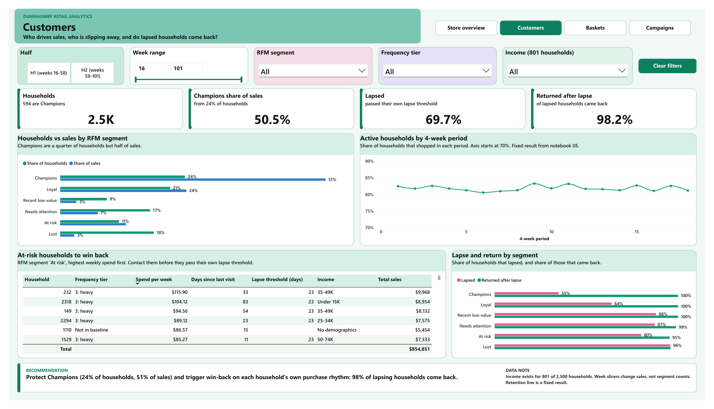
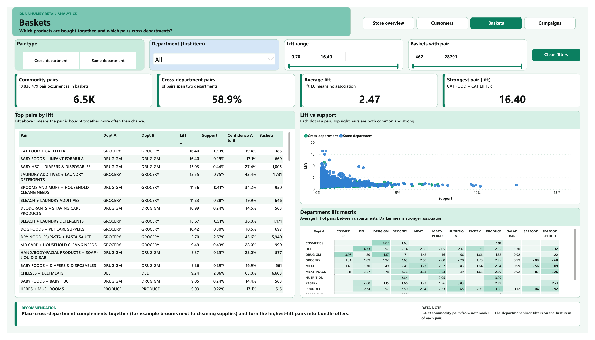
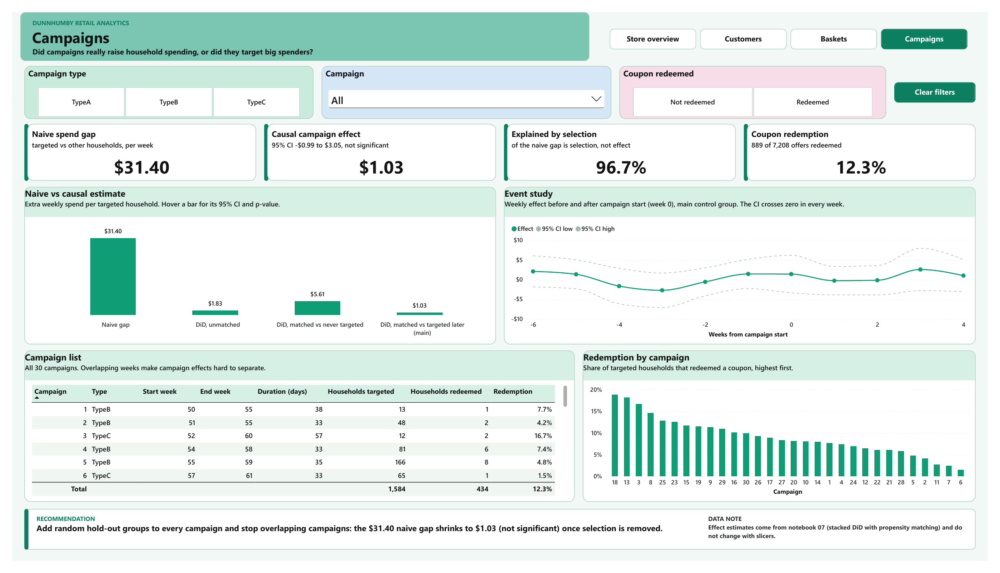

# Dunnhumby Retail Analytics

Customer and campaign analysis of a grocery retailer using Dunnhumby's *The Complete Journey* dataset: 2,500 households, 2 years of transactions, 30 marketing campaigns.

The main question I wanted to answer was whether the retailer's campaigns actually made households spend more. Targeted households spent $31.40 a week more than everyone else, which looks like a big win. After matching and a difference-in-differences design, the real effect was +$1.03 a week, and not significant. Almost all of the gap was down to who got picked for campaigns, not what the campaigns did.

Around that I also looked at who drives sales, how households lapse and come back, and which products are bought together. Everything ends in a Power BI dashboard.

## Key findings

| Area | Finding | Recommendation |
|---|---|---|
| Customers (RFM) | Champions are 23.8% of households but bring 50.5% of sales. 280 "At risk" households spend like Loyal ones but have not shopped for 33 days. | Protect Champions. Contact At risk households before they drift further. |
| Retention | 70% of households broke their normal shopping rhythm at least once, but 98% of them came back. Only 1.2% never returned. Households that buy from more departments break less often (hazard ratio 0.78). | Manage breaks, not churn. Trigger reminders on each household's own rhythm instead of one fixed "30 days" rule. |
| Baskets | Strongest links are need-based: cat food and litter (lift 16.4), pasta and sauce (9.7, 5,940 baskets), brooms or mops with cleaning products (11.6, across two departments). | Place cross-department pairs together. Offer the second item to the weaker direction of a pair instead of discounting both. |
| Campaigns | Naive gap $31.40 a week. Causal estimate +$1.03 a week (95% CI -$0.99 to $3.05, p = 0.32). Coupons mostly discounted purchases that would have happened anyway. | Add a random 5 to 10% hold-out to every campaign and stop overlapping campaigns for the same household. |

Baseline for everything: over 86 stable weeks, 2,493 households made 230,892 trips and spent $6.81M. The average household spends $31.78 a week.

## Dashboard

4 pages built in Power BI on a star schema (1 fact table, 9 supporting tables), with DAX measures, slicers and a recommendation on every page. Full PDF: [Dunnhumby_Dashboard.pdf](outputs/dashboard/Dunnhumby_Dashboard.pdf)

| Customers | Baskets | Campaigns |
|---|---|---|
|  |  |  |

## Notebooks

Run them in order. All data work is SQL in DuckDB on Parquet files, Python is used for the statistics and charts.

| Notebook | What it does |
|---|---|
| [01_download_data](notebooks/01_download_data.ipynb) | Downloads the 8 tables from Kaggle and converts them to Parquet |
| [02_data_audit](notebooks/02_data_audit.ipynb) | Checks keys and joins, finds data quirks (fuel lines, zero-value lines, ramp-up weeks) and writes clean tables |
| [03_sql_business_questions](notebooks/03_sql_business_questions.ipynb) | 12 questions a retail manager would ask, one SQL query each |
| [04_customer_segmentation](notebooks/04_customer_segmentation.ipynb) | RFM segmentation in SQL, checked against k-means |
| [05_retention_churn](notebooks/05_retention_churn.ipynb) | Survival analysis (Kaplan-Meier, Cox model) with a lapse threshold set per household |
| [06_basket_analysis](notebooks/06_basket_analysis.ipynb) | Market basket analysis with a SQL self-join: support, confidence, lift |
| [07_campaign_impact](notebooks/07_campaign_impact.ipynb) | Stacked difference-in-differences with propensity score matching, event study and placebo test |
| [08_powerbi_export](notebooks/08_powerbi_export.ipynb) | Builds and validates the 10 tables the dashboard reads |

## Tools

Python (DuckDB, pandas, scipy, statsmodels, lifelines, scikit-learn, matplotlib), SQL, Power BI (DAX), Google Colab.

## Run it yourself

1. Get a Kaggle API token and add it to Colab Secrets as `KAGGLE_API_TOKEN`.
2. Open the notebooks in Google Colab. They use a Drive folder called `Dunnhumby Project`, change `PROJ` in the first code cell if yours is different.
3. Run 01 to 08 in order. 01 downloads the data, 08 writes the Power BI tables to `outputs/powerbi/`.
4. The `.pbix` file opens with its data already loaded. To refresh it from your own copy, change the `DataFolder` parameter in Power Query to your `outputs/powerbi/` folder.

Packages are listed in `requirements.txt`.

## Data

[Dunnhumby: The Complete Journey](https://www.kaggle.com/datasets/frtgnn/dunnhumby-the-complete-journey) on Kaggle. The data is not included in this repo, notebook 01 downloads it.

A few things to know about it: days and weeks are numbered, not real dates. Only 801 of the 2,500 households have demographic data, and those households spend more than average, so income results describe engaged customers only.

## Limitations

- The campaign result mainly describes TypeA campaigns, since most TypeB and TypeC households were in overlapping campaigns and had to be excluded. It is the effect of being targeted, not of redeeming a coupon.
- Basket links are co-purchase patterns. They do not prove that promoting one item will sell the other.
- The breadth effect in retention is an association. Broad shoppers may simply be more committed customers.

## Author

Md. Ashiqur Rahman Khan (Ashik), B.Sc. in Statistics, Mawlana Bhashani Science and Technology University
